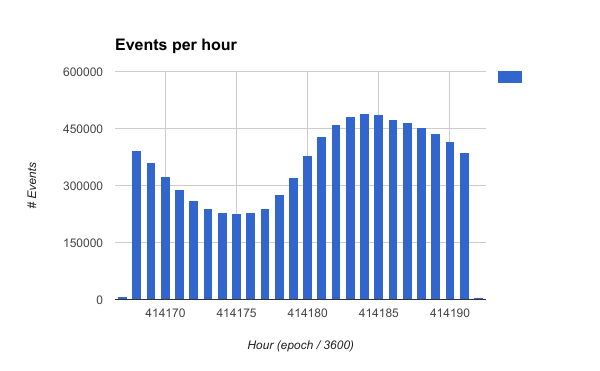

# Freckle Data Engineer Challenge
An open data engineering challenge based on real location data. Each entry in this data set is a "location-event". The idfa is the unique identifier of the user.

The expectation for this exercise is that you use Spark 2.x with Scala, Python, or Java. You can use the RDD or Dataframe APIs as you see fit, but please be ready to explain your choices. You must do your work over the entire dataset.

**Instructions:**

1. Fork this repo with your own id for our review.
2. Download the dataset here: https://s3.amazonaws.com/freckle-dataeng-challenge/location-data-sample.tar.gz
3. Answer: What is the max, min, avg, std dev for the location-events per IDFA?
4. Produce geohashes for all coordinates in a new RDD or DataFrame
5. Using the geohashes, determine if there clusters of people at any point in this dataset. If so, how many people and how close are they?
6. Write any findings into a local parquet format file for later use. 
7. *Bonus*: Conduct any additional analysis that might give a hint about the behaviour of the IDFAs in the data set.

Please complete as much of the assignment as you have time for. How long you had time to spend on the challenge and your experience will be considered. Have some fun with it!

# Usage

* Create fat jar by running `sbt assembly`
* Run `$SPARK_HOME/bin/spark-submit --class "org.callum.kift.freckle.Freckle" <path-to-jar> [arguments]`

where the arguments are 
```
Usage:  [options]

  -f, --func <value>       REQUIRED: func is the function name
  -i, --inputDirectory <value>
                           REQUIRED: The directory path to the input data
  -o, --outputDirectory <value>
                           OPTIONAL: Directory to save output files. If not given, does not save file.
  -c, --conf <value>       OPTIONAL: Path to config. If not given, uses conf in resources
  --help                   prints this usage text

Some notes.
 --func takes the values: stats, geohash, cluster
stats:- gets the max, min, avg, std dev for the location-events per IDFA
geohash:- hashes the coordinates of each event
cluster:- finds clusters of the people in a hashed location
```
To change the default values, create a configuration file with the format

```
stats {
  groupOn: "idfa"
  timeCol: "event_time"
  timeGrouping: "hour"
}

hashCluster {
  latCol: "lat"
  lngCol: "lng"
  hashLength: 9
}
```

* timeGrouping can take the values: second, minute, hour, day, week
* hasLength can take the values [1, 12]

# 3)
### stats (per hour) example output, ordered by 'max-hour'

|idfa                                |max-hour|min-hour|avg-hour         |stddev-hour      |
|------------------------------------|--------|--------|-----------------|-----------------|
|76441144-8d3c-43cc-aaaa-3366c7031125|4921    |1       |882.0714285714286|1647.771290341814|
|eb6f9b2d-c301-4d61-a40e-f226ba967c1b|3659    |3659    |3659.0           |NaN              |
|49c479bd-d839-4fbc-a3dd-cc5597965441|2310    |1       |358.6            |647.3961936704196|
|59092743-d13f-4260-8646-44848c34cc95|2294    |1       |373.6            |685.7874306226383|
|a4ddfd9b-71a7-41f1-8cf7-885d24ebecd7|2228    |8       |315.3            |678.5396164639992|

# 4)
### geohash example output
**N.B.**
* size is the geo-hashed box size in meters
* center is the latitude and longitude of the center of the geo-hashed box
* distanceToCenter is in meters

|geoHash  |lat              |lng               |size                                  |center                                 |distanceToCenter  |
|---------|-----------------|------------------|--------------------------------------|---------------------------------------|------------------|
|9xj32w4r1|39.6289256       |-105.0920479      |[4.764783808839858,3.684466215768936] |[39.62890863418579,-105.09206056594849]|2.17501882602523  |
|9vk47vts9|29.9577723       |-95.452578        |[4.757240194089673,4.142493272293079] |[29.957764148712158,-95.4525876045227] |1.2945938190382253|
|drt4k62nr|42.596473        |-71.5316391       |[4.767245804017567,3.5221704257538904]|[42.5964617729187,-71.53166055679321]  |2.157909663173805 |
|dr475f915|39.91627493863395|-75.41963541249277|[4.765020444511263,3.669177745392602] |[39.91626977920532,-75.41961908340454] |1.5090681982037277|
|dp6zvrr3u|42.1836947       |-85.8919524       |[4.766901340021862,3.5453229414331306]|[42.18370199203491,-85.89195013046265] |0.8313929629874127|

# 5)
### cluster example output, ordered by 'count'
**N.B.**
* center is the latitude and longitude of the center of the geo-hashed box
* size is the geo-hashed box size in meters

|geoHash  |center                                       |size                                  |count|
|---------|---------------------------------------------|--------------------------------------|-----|
|s00000000|[2.1457672119140625E-5,2.1457672119140625E-5]|[4.745333110755599,4.777314087730864] |12737|
|dpqhsdp7h|[41.58378839492798,-81.35459661483765]       |[4.766401655194122,3.578643165726302] |6167 |
|9v60zk9kj|[29.68851327896118,-98.11694383621216]       |[4.757046163897087,4.15361110877365]  |4066 |
|dn5qhzg7h|[34.84779596328735,-85.21629095077515]       |[4.760933457499529,3.9249026399233777]|3821 |
|dn5qhxwn7|[34.846980571746826,-85.22354364395142]      |[4.760932818313025,3.9249413541340807]|3501 |

# 6) 
To save dataframe to parquet file, give an `outputDirectory` as an argument when running the job.

# 7) Additional Analysis




### Most common of a few fields
|field|value|count|
|-----|-----|-----|
|idfa |00000000-0000-0000-0000-000000000000|15979|
|lat, lng|(0, 0)|12737|
|user_ip|70.197.128.98|12361|
|country_code|US          |6715156|
|place|Houston  |98790|
|api_key|9de1430e73cc96f15272a8a081d127746d3d4ef3d123b6adb|3731953|
|app_id|smartphones.collegescoreboard.football|2209154|


What one can look at in the future:
* See how events occur on a per-app, per-area basis, etc. 
* Instead of clustering on a specific area, with no time dependency, add this dependency to see if the clusters are at specific times
* The code currently has static (in-space) clusters. The GeoHash library used allows one to specify the center of a cluster and the size of it. This can then be a moving window over space, and eventually space-time.
* The IDFA is unique to each device, so one can see where they move over time (as the 'event_time' and 'lat/lng' is given). This can be used to predict where they might go next.

All of the above show what is a popular action and when, and where the person could go next. This allows one to know what will be in-demand in certain areas at certain times. This could lead to 'surge-pricing' content, discounting content during quiet times, and preempting the user's next location and what to show them.
 
Improvements in own code:
* For scaling: do not need to calculate 'size' and 'center' of geohash for every event. This only needs to be done for unique hashes and could be done in a separate dataframe (basically create a lookup table) and joined back in.
* `GeoHasher.findClusters` could be generalised so that the `groupBy` columns are an input.